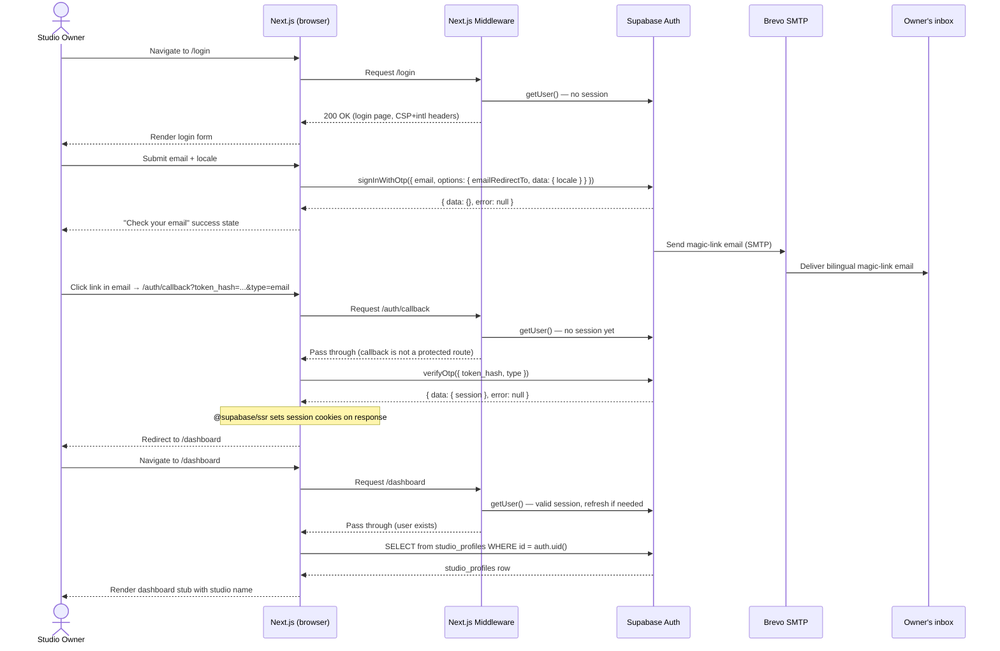
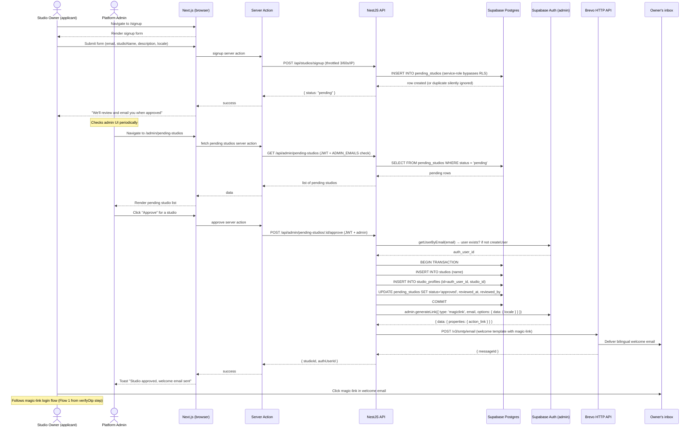
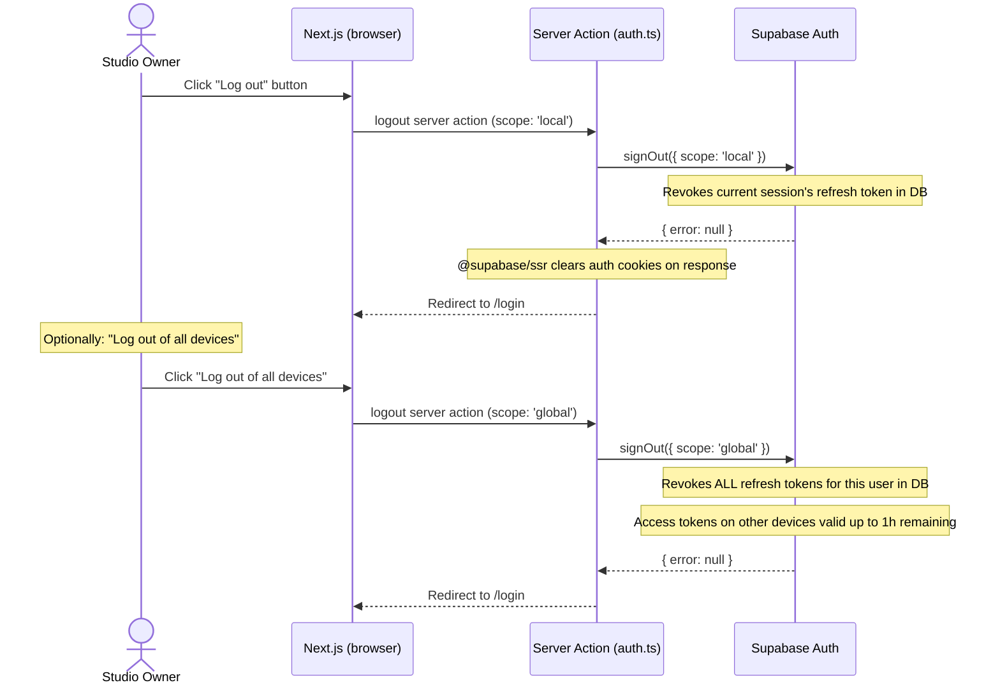

# Architecture: Studio Owner Authentication

**Spec:** docs/specs/CU-869d29f1f-studio-owner-auth.md
**Ticket:** CU-869d29f1f
**ADRs created:** ADR-0007, ADR-0008, ADR-0009
**Date:** 2026-05-03
**Author:** architect (agent)

---

## 1. Summary

Studio Owner Authentication introduces magic-link (email OTP) login, browser session management via `@supabase/ssr` cookies, route protection in Next.js middleware, a self-signup form that lands applicants in a `pending_studios` holding table, and an admin approval flow that creates `studios` + `studio_profiles` rows and dispatches a bilingual welcome email with a magic-link via Brevo. The feature is entirely self-contained within the Supabase Auth + Next.js + NestJS stack already locked by Foundation. No new infrastructure services are added. The dashboard is a stub — a server component that checks session and `studio_profiles` existence, rendering a pending-approval notice if the profile row does not exist.

---

## 2. Data model changes

### 2a. New tables

#### `pending_studio_status` (enum type)

```sql
CREATE TYPE public.pending_studio_status AS ENUM ('pending', 'approved', 'rejected');
```

#### `pending_studios`

```sql
CREATE TABLE public.pending_studios (
  id               uuid PRIMARY KEY DEFAULT gen_random_uuid(),
  email            text NOT NULL,
  studio_name      text NOT NULL,
  contact_phone    text,
  description      text NOT NULL,
  locale           text NOT NULL DEFAULT 'en',
  status           public.pending_studio_status NOT NULL DEFAULT 'pending',
  rejection_reason text,
  auth_user_id     uuid REFERENCES auth.users(id) ON DELETE SET NULL,
  submitted_at     timestamptz NOT NULL DEFAULT now(),
  reviewed_at      timestamptz,
  reviewed_by      uuid REFERENCES auth.users(id) ON DELETE SET NULL,
  CONSTRAINT pending_studios_email_unique UNIQUE (email)
);

ALTER TABLE public.pending_studios ENABLE ROW LEVEL SECURITY;
```

Indices:
- `idx_pending_studios_status` on `(status)` — admin list view filters by status.
- `idx_pending_studios_email` on `(email)` — duplicate check on signup.

RLS policies:

```sql
-- No INSERT policy: only service-role (NestJS) can insert (bypasses RLS)
-- No DELETE policy: nobody can delete via API

-- Admin SELECT
CREATE POLICY "admin_select_pending_studios"
  ON public.pending_studios
  FOR SELECT
  TO authenticated
  USING (
    current_user = 'service_role'
    OR email = ANY(
      string_to_array(
        current_setting('app.admin_emails', true), ','
      )
    )
  );

-- Admin UPDATE (approve/reject)
CREATE POLICY "admin_update_pending_studios"
  ON public.pending_studios
  FOR UPDATE
  TO authenticated
  USING (
    current_user = 'service_role'
    OR email = ANY(
      string_to_array(
        current_setting('app.admin_emails', true), ','
      )
    )
  )
  WITH CHECK (
    current_user = 'service_role'
    OR email = ANY(
      string_to_array(
        current_setting('app.admin_emails', true), ','
      )
    )
  );
```

#### `studios`

```sql
CREATE TABLE public.studios (
  id         uuid PRIMARY KEY DEFAULT gen_random_uuid(),
  name       text NOT NULL,
  created_at timestamptz NOT NULL DEFAULT now()
);

ALTER TABLE public.studios ENABLE ROW LEVEL SECURITY;
```

RLS policies:

```sql
-- Studio owner SELECT their own studio
CREATE POLICY "owner_select_studio"
  ON public.studios
  FOR SELECT
  TO authenticated
  USING (
    id IN (
      SELECT studio_id FROM public.studio_profiles
      WHERE id = auth.uid()
    )
  );

-- Studio owner UPDATE their own studio
CREATE POLICY "owner_update_studio"
  ON public.studios
  FOR UPDATE
  TO authenticated
  USING (
    id IN (
      SELECT studio_id FROM public.studio_profiles
      WHERE id = auth.uid()
    )
  )
  WITH CHECK (
    id IN (
      SELECT studio_id FROM public.studio_profiles
      WHERE id = auth.uid()
    )
  );

-- No INSERT or DELETE via API (only service-role/NestJS admin path)
```

#### `studio_profiles`

```sql
CREATE TABLE public.studio_profiles (
  id         uuid PRIMARY KEY REFERENCES auth.users(id) ON DELETE CASCADE,
  studio_id  uuid NOT NULL REFERENCES public.studios(id) ON DELETE CASCADE,
  created_at timestamptz NOT NULL DEFAULT now()
);

ALTER TABLE public.studio_profiles ENABLE ROW LEVEL SECURITY;
```

Indices:
- `idx_studio_profiles_studio_id` on `(studio_id)`.

RLS policies:

```sql
-- Owner SELECT own profile
CREATE POLICY "owner_select_studio_profile"
  ON public.studio_profiles
  FOR SELECT
  TO authenticated
  USING (id = auth.uid());

-- Owner UPDATE own profile
CREATE POLICY "owner_update_studio_profile"
  ON public.studio_profiles
  FOR UPDATE
  TO authenticated
  USING (id = auth.uid())
  WITH CHECK (id = auth.uid());

-- No INSERT or DELETE via API (only service-role/NestJS admin approval path)
```

### 2b. Migration plan

Three migration files, one concern each:

| Order | File name | Contents |
|---|---|---|
| 1 | `YYYYMMDDHHMMSS_create_pending_studios.sql` | enum type, `pending_studios` table, RLS, indices |
| 2 | `YYYYMMDDHHMMSS_create_studios.sql` | `studios` table, RLS |
| 3 | `YYYYMMDDHHMMSS_create_studio_profiles.sql` | `studio_profiles` table, RLS, FK |

Migrations are additive. Rollback: drop tables in reverse order (3, 2, 1). No data loss risk at this stage — no production data yet.

### 2c. pgTAP test files (ADR-0003 4-case minimum)

- `supabase/tests/rls_pending_studios_test.sql`
- `supabase/tests/rls_studios_test.sql`
- `supabase/tests/rls_studio_profiles_test.sql`

### 2d. Seed data (dev)

A seed file `supabase/seed.sql` creates one test studio and studio_profile linked to a test user in the local dev stack. This allows developer-fe to log in as a studio owner without running the full admin approval flow. The test user email is `owner@test.local` (Inbucket catches the magic-link email).

---

## 3. API contract

### New NestJS endpoints

All under `apps/api/src/studios/`.

#### `POST /api/studios/signup`

Public (no auth). Rate-limited: 3 req / 60s / IP via `@nestjs/throttler`.

Request body (`CreatePendingStudioDto`):
```json
{
  "email": "string (max 254, valid email format)",
  "studioName": "string (max 100)",
  "contactPhone": "string | null (max 20)",
  "description": "string (max 1000)",
  "locale": "\"es\" | \"en\""
}
```

Response `201`:
```json
{ "status": "pending" }
```

Response `201` on duplicate email (silent de-dup, same response — no enumeration):
```json
{ "status": "pending" }
```

Response `429`: rate limit hit (NestJS throttler default body).

Error cases:
- `400` — validation failure (invalid email, missing required fields).
- `429` — rate limit.
- `500` — unexpected DB error (do not expose details).

Swagger: `@ApiOperation`, `@ApiResponse(201)`, `@ApiResponse(400)`, `@ApiResponse(429)`.

#### `GET /api/admin/pending-studios`

Auth: JWT in `Authorization: Bearer` header, email must be in `ADMIN_EMAILS`.

Query params: `status?: 'pending' | 'approved' | 'rejected'` (default: `'pending'`), `page?: number`, `limit?: number` (default 20).

Response `200`:
```json
{
  "data": [
    {
      "id": "uuid",
      "email": "string",
      "studioName": "string",
      "contactPhone": "string | null",
      "description": "string",
      "locale": "string",
      "status": "pending | approved | rejected",
      "submittedAt": "ISO8601"
    }
  ],
  "total": "number",
  "page": "number",
  "limit": "number"
}
```

Response `403` — not admin.

#### `POST /api/admin/pending-studios/:id/approve`

Auth: JWT + admin email check.

Request body (`ApproveStudioDto`): empty (all data comes from the pending studio row).

Response `200`:
```json
{ "studioId": "uuid", "authUserId": "uuid" }
```

Response `404` — pending studio not found.
Response `409` — already approved.
Response `403` — not admin.

Side effects: creates `studios`, `studio_profiles`, updates `pending_studios`, generates magic-link, sends welcome email via Brevo.

#### `POST /api/admin/pending-studios/:id/reject`

Auth: JWT + admin email check.

Request body (`RejectStudioDto`):
```json
{ "reason": "string | null (max 500)" }
```

Response `200`: `{ "status": "rejected" }`.
Response `404`, `409` (already rejected), `403`.

### Supabase Auth endpoints (not NestJS — called directly from Next.js frontend)

- `supabase.auth.signInWithOtp({ email, options: { emailRedirectTo, data: { locale } } })` — login form submit.
- `supabase.auth.verifyOtp({ token_hash, type })` — auth callback route handler.
- `supabase.auth.signOut({ scope: 'local' | 'global' })` — logout server action.
- `supabase.auth.getUser()` — middleware, server components.

---

## 4. Frontend impact

### New routes

| Route (locale-prefixed) | Type | Auth required |
|---|---|---|
| `/login` | Page | No (redirect → `/dashboard` if authed) |
| `/signup` | Page | No |
| `/auth/callback` | Route Handler | No |
| `/dashboard` | Page (stub) | Yes (redirect → `/login?next=/dashboard` if not authed) |
| `/admin/pending-studios` | Page | Yes + admin check (404 if not admin) |

All routes exist under `app/[locale]/` in the Next.js app directory.

### New/modified files in `apps/web`

```
apps/web/
  middleware.ts                            MODIFIED — add Supabase session refresh + route protection
  utils/
    supabase/
      server.ts                            NEW — createServerClient wrapper
      client.ts                            NEW — createBrowserClient wrapper
  app/
    [locale]/
      login/
        page.tsx                           NEW — login form page
        _components/
          login-form.tsx                   NEW — "use client" form component
      signup/
        page.tsx                           NEW — signup form page
        _components/
          signup-form.tsx                  NEW — "use client" form component
      auth/
        callback/
          route.ts                         NEW — Route Handler (verifyOtp)
      dashboard/
        page.tsx                           NEW — dashboard stub (server component)
        _components/
          pending-approval-notice.tsx      NEW — shown when no studio_profiles row
          logout-button.tsx                NEW — "use client", calls logout server action
      admin/
        pending-studios/
          page.tsx                         NEW — admin list view (server component)
          _components/
            pending-studio-card.tsx        NEW
            approve-button.tsx             NEW — "use client"
            reject-modal.tsx               NEW — "use client"
  actions/
    auth.ts                                NEW — logout server action
    signup.ts                              NEW — calls NestJS signup endpoint
    admin.ts                               NEW — approve/reject server actions
  messages/
    es.json                                MODIFIED — add auth.* and admin.* keys
    en.json                                MODIFIED — add auth.* and admin.* keys
```

### New packages (`apps/web`)

```
@supabase/supabase-js   (latest)
@supabase/ssr           (^0.10.2)
react-hook-form         (^7.x — if not already installed)
```

### i18n key inventory

Both `messages/es.json` and `messages/en.json` must include all keys simultaneously.

**`auth.login.*`**
```
auth.login.title
auth.login.subtitle
auth.login.emailLabel
auth.login.emailPlaceholder
auth.login.submitButton
auth.login.submittingButton
auth.login.successTitle
auth.login.successMessage
auth.login.resendButton
auth.login.errors.emailRequired
auth.login.errors.emailInvalid
auth.login.errors.tooManyRequests
auth.login.errors.genericError
auth.login.rateLimitMessage
```

**`auth.callback.*`**
```
auth.callback.redirecting
auth.callback.errors.linkExpired
auth.callback.errors.invalidLink
auth.callback.errors.networkError
```

**`auth.logout.*`**
```
auth.logout.button
auth.logout.allDevicesButton
auth.logout.confirmPrompt
```

**`auth.signup.*`**
```
auth.signup.title
auth.signup.subtitle
auth.signup.fields.email
auth.signup.fields.studioName
auth.signup.fields.contactPhone
auth.signup.fields.description
auth.signup.submitButton
auth.signup.successTitle
auth.signup.successMessage
auth.signup.errors.emailRequired
auth.signup.errors.emailInvalid
auth.signup.errors.studioNameRequired
auth.signup.errors.descriptionRequired
auth.signup.errors.genericError
```

**`auth.dashboard.*`**
```
auth.dashboard.pendingApproval.title
auth.dashboard.pendingApproval.body
auth.dashboard.welcome
```

**`admin.pendingStudios.*`**
```
admin.pendingStudios.title
admin.pendingStudios.empty
admin.pendingStudios.columns.email
admin.pendingStudios.columns.studioName
admin.pendingStudios.columns.phone
admin.pendingStudios.columns.description
admin.pendingStudios.columns.submittedAt
admin.pendingStudios.actions.approve
admin.pendingStudios.actions.reject
admin.pendingStudios.rejectModal.title
admin.pendingStudios.rejectModal.reasonLabel
admin.pendingStudios.rejectModal.reasonPlaceholder
admin.pendingStudios.rejectModal.confirmButton
admin.pendingStudios.rejectModal.cancelButton
admin.pendingStudios.toast.approveSuccess
admin.pendingStudios.toast.approveError
admin.pendingStudios.toast.rejectSuccess
admin.pendingStudios.toast.rejectError
```

---

## 5. Integrations

### Supabase Auth

- Magic-link OTP dispatch via `signInWithOtp()` (frontend → Supabase Auth directly).
- Token exchange via `verifyOtp()` in the auth callback Route Handler.
- Session cookie management via `@supabase/ssr` cookie handlers in middleware and server utils.
- Admin operations via service-role key in NestJS: `admin.generateLink()`, `admin.getUserByEmail()`, `admin.createUser()`.

### Brevo

Two integration points:

1. **SMTP** (Supabase Auth → Brevo → user's inbox): magic-link request emails dispatched by Supabase. Configured in `config.toml` `[auth.email.smtp]`. Credentials: `BREVO_SMTP_USER`, `BREVO_SMTP_PASS` (SMTP key — not API key).

2. **HTTP API** (NestJS → Brevo → user's inbox): welcome email dispatched by NestJS on admin approval. Credential: `BREVO_API_KEY`. Endpoint: `POST https://api.brevo.com/v3/smtp/email`.

### Next.js middleware

The existing `middleware.ts` is extended to add Supabase session refresh and route protection, per ADR-0007. Execution order: Supabase refresh → route protection → next-intl → CSP headers. See ADR-0007 §2 for the exact implementation shape.

---

## 6. Sequence diagrams

### Flow 1: Magic-link login (happy path)



### Flow 2: Self-signup → admin approval → first login



### Flow 3: Logout (local + all-devices)



---

## 7. Performance and scale notes

Expected load: 1–10 concurrent studio owners. Authentication requests hit Supabase Auth (external network call per middleware invocation). At this scale, no caching is needed.

Index `idx_pending_studios_status` supports the admin list query (`WHERE status = 'pending'`) at near-zero cost for the volumes expected in v1 (tens to hundreds of rows total, ever).

The dashboard `studio_profiles` lookup is a single-row point query by primary key (`WHERE id = auth.uid()`) — O(1) regardless of table size.

Pagination on `GET /api/admin/pending-studios` (default limit 20) is a future-proofing measure; at v1 scale it is not needed.

---

## 8. Security notes

### Authorization model

- Magic-link is the sole authentication mechanism. No passwords. No OAuth.
- Session tokens: 1-hour JWT, 1-week refresh token maximum.
- Route protection: Next.js middleware checks `getUser()` and redirects unauthenticated requests before any page renders. Protected prefixes: `/dashboard`, `/admin`.
- Admin routes return 404 (not 403) for non-admin requests to avoid route discovery.
- Admin identity: `ADMIN_EMAILS` env var on NestJS, validated after JWT verification. Admin must be a valid Supabase Auth user first.

### Data validation points

- Signup form: zod schema in `packages/shared` (`CreatePendingStudioDto`), validated both in NestJS (`class-validator`) and in the Next.js form (`react-hook-form` + zod resolver).
- Email max 254 chars, studio name max 100 chars, description max 1000 chars.
- Approve/reject endpoints: `id` param is a UUID — NestJS `ParseUUIDPipe` on the param.

### Rate limiting

- `/api/studios/signup`: 3 requests per 60 seconds per IP (`@nestjs/throttler`).
- `supabase.auth.signInWithOtp()`: `max_frequency = "60s"` in production (Supabase Auth layer).
- Admin endpoints: protected by JWT + admin check (no additional throttling needed).

### PII handling

- `pending_studios.email` is PII. Access via RLS is limited to service-role (NestJS) and admin users.
- Studio owner emails are never logged in application logs (NestJS, Next.js). Log the `auth_user_id` (UUID) for correlation instead.
- Analytics events use `email_domain` (domain part only, not full address) per spec §6.
- The Brevo "Sent with Brevo" footer is present on free-tier emails — this is cosmetic and contains no PII about recipients.

### Redirect URL security

- Supabase redirect allow-list includes only `localhost`, `127.0.0.1:3000`, and the account-slug-scoped Vercel preview wildcard.
- Production allow-list: exact URL only (`https://massage-tulum.com/**`).
- `emailRedirectTo` is always set to `<origin>/auth/callback` — not to an arbitrary caller-supplied value.

### CORS / CSP

- CSP from ADR-0006 is preserved. Supabase Auth URLs (`https://*.supabase.co`) are already in `connect-src`.
- No CORS changes needed — Next.js frontend communicates with Supabase directly (same-origin from the browser's perspective in terms of CSP) and with NestJS API via Server Actions (server-to-server, no CORS concern).

---

## 9. Ticket breakdown

Work is split into four developer tickets. Ticket 1 (BE) is a dependency for Ticket 3 (FE admin) and partially for Ticket 2 (FE uses the NestJS signup endpoint). Ticket 4 (DevOps) can run in parallel.

| Ticket | Title | Agent | Size | Depends on |
|---|---|---|---|---|
| AUTH-BE-1 | `[BE] Studios module: signup endpoint + admin approval/reject endpoints + Supabase service-role integration` | developer-be | M | — |
| AUTH-FE-1 | `[FE] Magic-link auth: login page, auth callback, dashboard stub, logout, middleware update` | developer-fe | M | — (uses Supabase directly, not NestJS) |
| AUTH-FE-2 | `[FE] Self-signup form + admin pending-studios UI` | developer-fe | M | AUTH-BE-1 (calls signup endpoint; admin UI calls approval/reject endpoints) |
| AUTH-DEVOPS-1 | `[DEVOPS] Supabase config: SMTP, redirect URLs, email templates, production max_frequency` | developer-devops | S | — |

### AUTH-BE-1: Studios module

**Acceptance criteria (from spec):**
- AC-20: POST /api/studios/signup creates pending_studios row (or silently de-dups).
- AC-23: POST /api/admin/pending-studios/:id/approve atomically creates studios + studio_profiles, marks pending row approved, sends bilingual welcome email.
- AC-24: POST /api/admin/pending-studios/:id/reject updates status + reason.
- AC-26: RLS policies for all three tables pass pgTAP 4-case test suite.

**Files to create/modify:**
- `apps/api/src/studios/` (full module)
- `apps/api/src/studios/guards/admin.guard.ts`
- `packages/shared/src/schemas/pending-studio.schema.ts` (zod schema, shared with FE)
- `supabase/migrations/` — 3 migration files (pending_studios, studios, studio_profiles)
- `supabase/tests/rls_pending_studios_test.sql`
- `supabase/tests/rls_studios_test.sql`
- `supabase/tests/rls_studio_profiles_test.sql`
- `supabase/seed.sql` — add test studio owner seed

**Dependencies:** none (migration work can proceed independently).

### AUTH-FE-1: Magic-link auth

**Acceptance criteria (from spec):**
- AC-1 through AC-19 (magic-link request, callback, session, logout, route protection, accessibility).
- AC-25: dashboard renders pending-approval notice when no studio_profiles row.

**Files to create/modify:**
- `apps/web/middleware.ts` (extend existing)
- `apps/web/utils/supabase/server.ts` (new)
- `apps/web/utils/supabase/client.ts` (new)
- `apps/web/app/[locale]/login/` (new)
- `apps/web/app/[locale]/auth/callback/route.ts` (new)
- `apps/web/app/[locale]/dashboard/` (new stub)
- `apps/web/actions/auth.ts` (new)
- `apps/web/messages/es.json` + `en.json` (add auth.login.*, auth.callback.*, auth.logout.*, auth.dashboard.*)
- `supabase/templates/magic-link.html` (new)

**Dependencies:** AUTH-DEVOPS-1 must complete SMTP config before live email testing, but FE development against Inbucket is independent.

### AUTH-FE-2: Self-signup + admin UI

**Acceptance criteria (from spec):**
- AC-20, AC-21 (signup form + silent de-dup).
- AC-22 (admin route returns 404 for non-admin).
- AC-23, AC-24 (approve/reject actions from admin UI).

**Files to create/modify:**
- `apps/web/app/[locale]/signup/` (new)
- `apps/web/app/[locale]/admin/pending-studios/` (new)
- `apps/web/actions/signup.ts` (new)
- `apps/web/actions/admin.ts` (new)
- `apps/web/messages/es.json` + `en.json` (add auth.signup.*, admin.pendingStudios.*)
- `supabase/templates/welcome.html` (new — content used by NestJS service)

**Dependencies:** AUTH-BE-1 (calls NestJS signup and approval endpoints).

### AUTH-DEVOPS-1: Supabase configuration

**Acceptance criteria:**
- Brevo SMTP configured in `supabase/config.toml` (uncomment + env var references).
- `additional_redirect_urls` updated in `config.toml` with account-slug wildcard.
- Hosted dev Supabase project: SMTP settings, redirect allow-list, email templates copied from `supabase/templates/` to Dashboard.
- `max_frequency = "60s"` documented for production (runbook step — not in `config.toml` which is dev config).
- `docs/runbooks/supabase-project-setup.md` updated with template deployment steps.
- `.env.example` files updated with new variables.

**Files to create/modify:**
- `supabase/config.toml`
- `apps/api/.env.example` (add BREVO_API_KEY, ADMIN_EMAILS)
- `apps/web/.env.example` (no new vars — Supabase vars already present)
- `docs/runbooks/supabase-project-setup.md` (new or extend)

**Dependencies:** none (can proceed in parallel with all FE/BE work).

---

## 10. Open questions

None that block implementation. The following items are flagged for human awareness at GATE 2:

**GATE 2 items for human review:**

1. **Vercel account slug.** The redirect URL wildcard `https://*-<account-slug>.vercel.app/**` requires the actual Vercel account slug. Developer-devops must insert this value into `config.toml` and the hosted Supabase allow-list. Current placeholder: `djb4e` (from git config). Confirm this is the correct Vercel account slug.

2. **`massage-tulum.com` domain ownership and DNS control.** DKIM/DMARC records for Brevo sender domain verification are required before go-live. This is a DNS change on the production domain. Developer-devops will document the required records in the runbook; the human performs the DNS change.

3. **Brevo credentials.** `BREVO_SMTP_USER`, `BREVO_SMTP_PASS` (SMTP key), and `BREVO_API_KEY` must be obtained from the Brevo Dashboard by the human and stored in Coolify (NestJS) and Vercel env vars (none needed on frontend for Brevo). Developer-devops will prompt for these in the runbook.

4. **`ADMIN_EMAILS` value.** The platform admin email must be set in Coolify as `ADMIN_EMAILS=<email>` before the admin approval flow can be used. Human to provide the email and store in Coolify.

5. **NestJS JWT verification ADR.** The spec §7 notes that future NestJS API-backed features will require the NestJS API to verify Supabase JWTs. This ADR is not in scope here but must be written before the first feature that requires NestJS to authenticate a studio owner's request. Flagged for the next feature's architect work.
