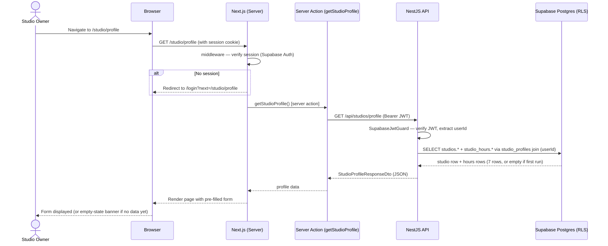

# Architecture: Studio Profile Setup

**Spec:** ClickUp Doc 8cjnt23-12332 (page 8cjnt23-20712)
**Ticket:** CU-869d29f1h
**ADRs created:** ADR-0011 (phone storage format), ADR-0012 (business hours time storage)
**Date:** 2026-05-03
**Author:** architect (agent)

---

## 1. Summary

Studio Profile Setup allows an approved studio owner to view and edit their studio's public-facing information: name, description, phone (doubles as WhatsApp), email, and per-weekday operating hours. Data is stored in two new database objects: new columns added to the existing `studios` table (name, address fields, phone, email, description), and a new `studio_hours` table (7 rows per studio, one per weekday). The NestJS API gains two new endpoints (`GET` and `PATCH` under `/api/studios/profile`). The Next.js app gains one new authenticated page at `/studio/profile`. This feature has no new external service dependencies — it uses Supabase (existing), the NestJS studios module (existing), and Next.js server actions (pattern already established by auth).

---

## 2. Data model changes

### 2a. Schema reconciliation — ownership model

The spec §7 mentions `auth.uid() = studios.owner_id`, but no `owner_id` column exists on `studios`. The auth wave (CU-869d29f1f) established the ownership model via the `studio_profiles` join table: `studio_profiles.id = auth.uid()` and `studio_profiles.studio_id = studios.id`. This pattern is already on `main` with RLS policies deployed.

**Decision: continue using the `studio_profiles`-join pattern.** Do NOT add an `owner_id` column to `studios`. All new RLS policies on this feature's tables follow the same pattern. This is a re-affirmation of the auth wave's design, not a new decision — no ADR needed.

### 2b. ALTER `studios` table — add profile columns

Option (i) — extending `studios` with first-class profile columns — is chosen over option (ii) (separate `studio_profile_data` table). Rationale: `studios` is the canonical studio entity. Profile information (phone, email, description) is logically part of that entity. A separate 1:1 table adds a JOIN with no benefit. The `studios` table is still small and this feature's columns are its natural profile fields.

Migration: `20260504000001_alter_studios_add_profile_columns.sql`

```sql
ALTER TABLE public.studios
  ADD COLUMN description text,
  ADD COLUMN phone       text CHECK (phone ~ '^\+[1-9]\d{6,14}$'),
  ADD COLUMN email       text CHECK (email ~* '^[^@]+@[^@]+\.[^@]+$'),
  ADD COLUMN updated_at  timestamptz NOT NULL DEFAULT now();
```

Notes:
- `phone` stores E.164 format (ADR-0011). The CHECK constraint enforces basic E.164 structure as defense-in-depth.
- `email` CHECK is a loose format guard; full validation happens in application layer.
- `name` already exists (NOT NULL) — no change needed. The profile form's "studio name" field maps to `studios.name`.
- `description` is nullable (optional field).
- `updated_at` is added to track last profile save.
- `address` is NOT in scope for v1 per spec. The field list is: name, description, phone, email, hours.

No RLS change needed — the existing `owner_select_studio` and `owner_update_studio` policies on `public.studios` already grant the studio owner SELECT and UPDATE on their own studio row.

Rollback:
```sql
ALTER TABLE public.studios
  DROP COLUMN IF EXISTS description,
  DROP COLUMN IF EXISTS phone,
  DROP COLUMN IF EXISTS email,
  DROP COLUMN IF EXISTS updated_at;
```

### 2c. New table: `studio_hours`

Migration: `20260504000002_create_studio_hours.sql`

```sql
CREATE TABLE public.studio_hours (
  studio_id  uuid    NOT NULL REFERENCES public.studios(id) ON DELETE CASCADE,
  weekday    smallint NOT NULL CHECK (weekday BETWEEN 1 AND 7),
  -- 1 = Monday, 7 = Sunday (ISO 8601 day-of-week convention)
  is_open    boolean NOT NULL DEFAULT false,
  open_time  time,   -- NULL when is_open = false (ADR-0012)
  close_time time,   -- NULL when is_open = false (ADR-0012)
  CONSTRAINT pk_studio_hours PRIMARY KEY (studio_id, weekday),
  CONSTRAINT chk_hours_close_after_open CHECK (
    is_open = false
    OR (
      open_time  IS NOT NULL
      AND close_time IS NOT NULL
      AND close_time > open_time
    )
  )
);

-- RLS baseline (ADR-0003 Convention 1)
ALTER TABLE public.studio_hours ENABLE ROW LEVEL SECURITY;

-- SELECT: Studio owner can read their own studio's hours
CREATE POLICY "owner_select_studio_hours"
  ON public.studio_hours
  FOR SELECT
  TO authenticated
  USING (
    studio_id IN (
      SELECT studio_id FROM public.studio_profiles
      WHERE id = auth.uid()
    )
  );

-- INSERT: Studio owner can insert hours for their own studio
CREATE POLICY "owner_insert_studio_hours"
  ON public.studio_hours
  FOR INSERT
  TO authenticated
  WITH CHECK (
    studio_id IN (
      SELECT studio_id FROM public.studio_profiles
      WHERE id = auth.uid()
    )
  );

-- UPDATE: Studio owner can update their own studio's hours
CREATE POLICY "owner_update_studio_hours"
  ON public.studio_hours
  FOR UPDATE
  TO authenticated
  USING (
    studio_id IN (
      SELECT studio_id FROM public.studio_profiles
      WHERE id = auth.uid()
    )
  )
  WITH CHECK (
    studio_id IN (
      SELECT studio_id FROM public.studio_profiles
      WHERE id = auth.uid()
    )
  );

-- DELETE: Studio owner can delete their own studio's hours rows
-- (needed for the atomic upsert strategy: DELETE + INSERT all 7 rows)
CREATE POLICY "owner_delete_studio_hours"
  ON public.studio_hours
  FOR DELETE
  TO authenticated
  USING (
    studio_id IN (
      SELECT studio_id FROM public.studio_profiles
      WHERE id = auth.uid()
    )
  );

-- No anon access; no cross-owner access.
```

Weekday encoding: ISO 8601 — `1` = Monday, `7` = Sunday. This matches the design spec (Monday-first display) and is consistent with Postgres `EXTRACT(ISODOW FROM timestamp)` for future booking queries.

Rollback: `DROP TABLE IF EXISTS public.studio_hours;`

### 2d. Hours atomicity — DELETE + INSERT strategy

The spec requires all 7 hours rows to be saved in a single transaction (AC hours-6). The implementation uses an atomic DELETE + INSERT within a single Supabase service-role transaction call (from NestJS):

```
BEGIN;
DELETE FROM public.studio_hours WHERE studio_id = $1;
INSERT INTO public.studio_hours (studio_id, weekday, is_open, open_time, close_time)
VALUES ($1, 1, ...), ($1, 2, ...), ..., ($1, 7, ...);
COMMIT;
```

This is simpler and more reliable than UPSERT (no ON CONFLICT handling needed, no partial row concerns). The `studio_id` DELETE + INSERT is atomic from the database's perspective.

The NestJS service uses the Supabase client's `rpc()` call to a Postgres function, or alternatively uses the REST API with `prefer: resolution=merge-duplicates` + UPSERT. Given the simple 7-row atomic replace requirement, a Postgres function (`upsert_studio_hours`) is the cleanest approach — it keeps the transaction boundary in the DB.

```sql
-- Migration: 20260504000003_create_upsert_studio_hours_fn.sql
CREATE OR REPLACE FUNCTION public.upsert_studio_hours(
  p_studio_id uuid,
  p_hours jsonb  -- array of {weekday, is_open, open_time, close_time}
)
RETURNS void
LANGUAGE plpgsql
SECURITY INVOKER  -- runs as the authenticated user; RLS applies
AS $$
BEGIN
  DELETE FROM public.studio_hours WHERE studio_id = p_studio_id;

  INSERT INTO public.studio_hours (studio_id, weekday, is_open, open_time, close_time)
  SELECT
    p_studio_id,
    (elem->>'weekday')::smallint,
    (elem->>'is_open')::boolean,
    NULLIF(elem->>'open_time', '')::time,
    NULLIF(elem->>'close_time', '')::time
  FROM jsonb_array_elements(p_hours) AS elem;
END;
$$;
```

`SECURITY INVOKER` means the function runs as the authenticated user — RLS on `studio_hours` applies. The owner RLS policies (SELECT, INSERT, UPDATE, DELETE) cover the operations inside this function.

### 2e. pgTAP test files (ADR-0003 minimum 4 cases)

File: `supabase/tests/rls_studio_hours_test.sql`

Four required cases:
1. `anon-read-blocked` — anon role SELECT returns empty.
2. `owner-read-allowed` — authenticated owner can SELECT their own studio's hours.
3. `cross-owner-read-blocked` — authenticated owner cannot SELECT another studio's hours.
4. `anon-write-blocked` — anon role INSERT throws RLS violation.

Additional cases (beyond minimum):
5. `owner-can-insert` — authenticated owner can INSERT hours for their own studio.
6. `cross-owner-insert-blocked` — authenticated owner cannot INSERT hours for another studio.

### 2f. Seed data (dev)

Extend `supabase/seed.sql` to insert default hours for the test studio (`is_open = false` for all 7 days). This allows the FE developer to see the hours section in a populated but blank state on first load.

---

## 3. API contract

All new endpoints extend the existing `StudiosController` in `apps/api/src/studios/`. Auth is required via the `JwtAuthGuard` (resolves the flagged open question from AUTH architecture §10 item 5 — the NestJS JWT verification ADR is now needed; see §10 Open Questions below).

### 3a. NestJS JWT guard prerequisite

The profile endpoints must verify the Supabase JWT. The auth wave (CU-869d29f1f) deferred this ADR. It is now required before the BE ticket can complete. The developer-be ticket must implement a `SupabaseJwtGuard` that:
1. Reads `Authorization: Bearer <token>` from the request.
2. Verifies the JWT using the Supabase JWT secret (`SUPABASE_JWT_SECRET` env var).
3. Attaches `req.user = { id: userId, email }` for downstream use.

This guard is needed to determine which studio belongs to the authenticated user (the profile endpoints are user-scoped, not admin-scoped).

### 3b. `GET /api/studios/profile`

Returns the authenticated studio owner's studio profile (name, description, phone, email) and all 7 hours rows.

**Auth:** Bearer JWT (SupabaseJwtGuard). Returns `401` if no/invalid token.

**Request:** No body.

**Response `200`:**
```json
{
  "id": "uuid",
  "name": "string",
  "description": "string | null",
  "phone": "string | null",
  "email": "string | null",
  "updatedAt": "ISO8601 | null",
  "hours": [
    {
      "weekday": 1,
      "isOpen": false,
      "openTime": "09:00",
      "closeTime": "18:00"
    },
    ...
  ]
}
```

`hours` is always a 7-element array (weekday 1–7), ordered by weekday ascending. If the studio has no `studio_hours` rows yet (first-time setup), returns all 7 with `isOpen: false, openTime: null, closeTime: null`.

`openTime` / `closeTime`: Postgres returns `"HH:MM:SS"`; NestJS serialization strips to `"HH:MM"` (ref ADR-0012).

**Error cases:**
- `401` — missing/invalid JWT.
- `404` — no `studio_profiles` row for this user (should not happen post-auth, but defensive).
- `500` — unexpected DB error.

### 3c. `PATCH /api/studios/profile`

Saves all profile fields and all 7 hours rows atomically.

**Auth:** Bearer JWT (SupabaseJwtGuard).

**Request body (`UpdateStudioProfileDto`):**
```json
{
  "name": "string (required, 1–120 chars after trim)",
  "description": "string | null (max 500 chars)",
  "phone": "string | null (E.164 after validation)",
  "email": "string | null (valid email format)",
  "hours": [
    {
      "weekday": 1,
      "isOpen": true,
      "openTime": "09:00",
      "closeTime": "19:00"
    },
    ...
  ]
}
```

Business rules enforced in the DTO:
- `name`: required, trimmed, 1–120 characters.
- At least one of `phone` or `email` must be non-null/non-empty (cross-field validation).
- `phone`: if provided, must be a valid phone number. Stored as E.164 (normalized by NestJS before DB write using `libphonenumber-js`).
- `email`: if provided, must match email format.
- `hours`: array of exactly 7 items, weekdays 1–7 each appearing exactly once. When `isOpen = false`, `openTime` and `closeTime` are ignored (treated as null). When `isOpen = true`, both times are required and `closeTime > openTime`.
- `openTime` / `closeTime`: `"HH:MM"` format string (pattern `^([01]\d|2[0-3]):[0-5]\d$`).

**Response `200`:**
Same shape as `GET /api/studios/profile` response (the updated profile).

**Error cases:**
- `400` — validation failure (with field-level `errors` array).
- `401` — missing/invalid JWT.
- `404` — no studio profile found for this user.
- `500` — unexpected DB error.

**Swagger:** All endpoints decorated with `@ApiOperation`, `@ApiResponse`, `@ApiBearerAuth`.

### 3d. Zod schemas (`packages/shared`)

New file: `packages/shared/src/schemas/studio-profile.schema.ts`

Exports:
- `studioProfileResponseSchema` — for FE to parse/validate API responses.
- `updateStudioProfileSchema` — the form schema used by react-hook-form + zod resolver on FE and as the base for the NestJS DTO validation.
- `studioHoursSchema` — the hours sub-schema (7-row array with cross-row validations).

Imports `phoneSchema` from `packages/shared/src/schemas/phone.schema.ts` (ADR-0011).

---

## 4. Frontend impact

### 4a. New route

`/studio/profile` (locale-prefixed per next-intl: `/studio/profile` for ES default, `/en/studio/profile` for EN).

**URL localization decision:** The URL path segment `profile` is the same in both locales (not translated). This matches the existing auth pattern (`/login`, `/dashboard` are not translated). Locale-prefixed paths with untranslated segments are correct usage of next-intl's `as-needed` prefix strategy. No change to `i18n/routing.ts` is needed — the route registers naturally under `app/[locale]/studio/profile/`.

### 4b. Auth requirement

The page is protected — unauthenticated users are redirected to `/login?next=/studio/profile`. This is handled by the existing middleware pattern (auth wave). No middleware changes needed.

### 4c. New files in `apps/web`

```
apps/web/
  app/
    [locale]/
      studio/
        profile/
          page.tsx                    NEW — Server Component; fetches profile via server action;
                                           renders StudioProfileForm or skeleton/error states
          _components/
            studio-profile-form.tsx   NEW — "use client"; react-hook-form + zod; hours grid
            time-picker.tsx           NEW — "use client"; 12h time picker wrapper (see §4e)
            hours-row.tsx             NEW — "use client"; single day row (toggle + pickers)
            form-section.tsx          NEW — server-renderable section wrapper with title
            page-header.tsx           NEW — page title + save button (passed loading state)
  actions/
    studio-profile.ts                 NEW — getStudioProfile() + updateStudioProfile() server actions
  messages/
    es.json                           MODIFIED — add studioProfile.* + common.day.* keys
    en.json                           MODIFIED — add studioProfile.* + common.day.* keys
```

### 4d. Dashboard nav link

The dashboard page (`/dashboard`) currently is a stub. The design spec says the profile page is "accessible from header" — nav design is deferred to the auth feature. **Decision:** adding a nav link to `/studio/profile` is in-scope for this ticket (a small stub link in the dashboard or header is sufficient). The developer-fe adds a temporary direct link from the dashboard to `/studio/profile`; full nav design comes later. This keeps the feature reachable without requiring a full nav implementation.

### 4e. Time picker implementation (R2 resolution)

**Decision: native HTML `<input type="time">` with a thin wrapper that enforces 12h display.**

Rationale:
- Native `<input type="time">` is CSP-safe (no inline scripts, no external JS).
- Browsers render it in the system's locale format. On macOS/iOS, Chrome/Safari show 12h format when the system is in en-US or es-MX locale. On desktop, the native picker is accessible (keyboard navigation, screen reader support).
- The wrapper component stores the value as `"HH:MM"` (24h) internally and converts for display using `Intl.DateTimeFormat` with `{ hour: 'numeric', minute: '2-digit', hour12: true }` for the accessible label/hint text.
- Mobile: native `<input type="time">` on iOS/Android renders a system time picker — acceptable per design doc §12 ("drop-down style fallback is acceptable").
- Avoids adding a third-party time picker library, keeping the bundle lean and the CSP clean.

The `TimePicker` component:
```
<input
  type="time"
  value={value}           // "HH:MM" (24h)
  onChange={...}          // stores "HH:MM"
  aria-label={...}        // uses 12h formatted time for accessible label
/>
```

No additional libraries required. No ADR needed — this is a local implementation choice, not a cross-cutting decision.

### 4f. State management

No global state. The form uses local react-hook-form state. The `page.tsx` server component fetches once on load; edits are local to the form until save. Last-write-wins on concurrent edits (per GATE 1 spec decision). No optimistic update — the button enters a loading state and the response updates the form.

### 4g. i18n key inventory

All keys from `docs/design/studio-profile.md` §9 (Copy Keys) verbatim:

**`studioProfile.*` namespace:**

| Key | es | en |
|---|---|---|
| `studioProfile.page.title` | Perfil del estudio | Studio profile |
| `studioProfile.page.subtitle` | Información visible en tu página pública | Information visible on your public page |
| `studioProfile.action.save` | Guardar cambios | Save changes |
| `studioProfile.action.cancel` | Cancelar | Cancel |
| `studioProfile.section.basicInfo` | Información general | General information |
| `studioProfile.section.contact` | Contacto | Contact |
| `studioProfile.section.hours` | Horario de atención | Operating hours |
| `studioProfile.field.name.label` | Nombre del estudio | Studio name |
| `studioProfile.field.name.error.required` | El nombre del estudio es obligatorio | Studio name is required |
| `studioProfile.field.description.label` | Descripción | Description |
| `studioProfile.field.description.charCount` | {count}/500 | {count}/500 |
| `studioProfile.field.phone.label` | Teléfono (también WhatsApp) | Phone (also WhatsApp) |
| `studioProfile.field.phone.placeholder` | +52 984 123 4567 | +52 984 123 4567 |
| `studioProfile.field.phone.helper` | Este número se usará también para mensajes de WhatsApp | This number will also be used for WhatsApp messages |
| `studioProfile.field.email.label` | Correo electrónico | Email address |
| `studioProfile.field.email.error.format` | Ingresa un correo válido | Enter a valid email address |
| `studioProfile.field.contact.error.atLeastOne` | Debes ingresar al menos un método de contacto (teléfono o correo) | You must provide at least one contact method (phone or email) |
| `studioProfile.hours.timezone.note` | Los horarios son en hora de Cancún (CST/CDT) | Times are in Cancún time (CST/CDT) |
| `studioProfile.hours.open` | Apertura | Open |
| `studioProfile.hours.close` | Cierre | Close |
| `studioProfile.hours.closed` | Cerrado | Closed |
| `studioProfile.hours.closedLabel` | Cerrado | Closed |
| `studioProfile.hours.toggleClosed.label` | Marcar {day} como cerrado | Mark {day} as closed |
| `studioProfile.hours.toggleOpen.label` | Marcar {day} como abierto | Mark {day} as open |
| `studioProfile.hours.error.closeAfterOpen` | La hora de cierre debe ser posterior a la de apertura | Close time must be after open time |
| `studioProfile.loading` | Cargando perfil del estudio | Loading studio profile |
| `studioProfile.empty.title` | Completa tu perfil | Complete your profile |
| `studioProfile.empty.body` | Agrega el nombre y al menos un método de contacto para comenzar | Add your studio name and at least one contact method to get started |
| `studioProfile.loadError.title` | No se pudo cargar el perfil | Could not load profile |
| `studioProfile.loadError.body` | Ocurrió un error al cargar los datos del estudio. | An error occurred while loading studio data. |
| `studioProfile.loadError.retry` | Reintentar | Retry |
| `studioProfile.permission.title` | Sin acceso | Access denied |
| `studioProfile.permission.body` | No tienes permiso para ver esta página. | You do not have permission to view this page. |

**`common.day.*` namespace (new):**

| Key | es | en |
|---|---|---|
| `common.day.monday` | Lunes | Monday |
| `common.day.tuesday` | Martes | Tuesday |
| `common.day.wednesday` | Miércoles | Wednesday |
| `common.day.thursday` | Jueves | Thursday |
| `common.day.friday` | Viernes | Friday |
| `common.day.saturday` | Sábado | Saturday |
| `common.day.sunday` | Domingo | Sunday |
| `common.day.mon` | Lun | Mon |
| `common.day.tue` | Mar | Tue |
| `common.day.wed` | Mié | Wed |
| `common.day.thu` | Jue | Thu |
| `common.day.fri` | Vie | Fri |
| `common.day.sat` | Sáb | Sat |
| `common.day.sun` | Dom | Sun |

**Toast keys (shared namespace — already exists or create if not):**

| Key | es | en |
|---|---|---|
| `toast.success.saved.title` | Guardado | Saved |
| `toast.success.saved.description` | Los cambios se guardaron correctamente | Changes saved successfully |
| `toast.error.generic.title` | Error | Error |

---

## 5. Integrations

- **Supabase Postgres** — existing connection. New migrations, new Postgres function (`upsert_studio_hours`).
- **Supabase Auth** — existing session. The NestJS `SupabaseJwtGuard` reads and verifies the Bearer token using the Supabase JWT secret. No new Supabase Auth configuration.
- **NestJS API** — existing studios module extended with two endpoints.
- **No new external services.** No Brevo, no WhatsApp, no Stripe in this feature.

---

## 6. Sequence diagrams

### Flow 1: Load profile page (GET)



### Flow 2: Save profile (PATCH)

```mermaid
sequenceDiagram
  actor Owner as Studio Owner
  participant Browser as Browser (Client Component)
  participant SA as Server Action (updateStudioProfile)
  participant BE as NestJS API
  participant DB as Supabase Postgres (RLS)

  Owner->>Browser: Fill form + click "Save changes"
  Browser->>Browser: Client-side zod validation (react-hook-form)
  alt Validation fails
    Browser-->>Owner: Inline field errors; no API call
  end
  Browser->>SA: updateStudioProfile(formData) [server action]
  SA->>BE: PATCH /api/studios/profile (Bearer JWT, body: UpdateStudioProfileDto)
  BE->>BE: SupabaseJwtGuard — verify JWT, extract userId
  BE->>BE: DTO validation (class-validator; cross-field phone|email check; hours array)
  alt DTO invalid
    BE-->>SA: 400 with field errors
    SA-->>Browser: Error response
    Browser-->>Owner: Inline field errors + toast error
  end
  BE->>DB: UPDATE studios SET name=..., phone=..., email=..., description=..., updated_at=now()
  BE->>DB: SELECT upsert_studio_hours(studio_id, hours_jsonb)
  Note over DB: DELETE + INSERT 7 rows in single transaction; RLS applies (SECURITY INVOKER)
  DB-->>BE: success
  BE-->>SA: 200 + updated profile DTO
  SA-->>Browser: Updated profile data
  Browser-->>Owner: Toast "Saved"; form shows new values
```

---

## 7. Performance and scale notes

Expected load: 1–10 studio owners, each saving their profile a handful of times. No caching or pagination needed. The hours upsert (DELETE + INSERT 7 rows) is trivial at this scale.

Indices: `studio_hours` uses a composite PK `(studio_id, weekday)` — all hours queries filter on `studio_id` which is the leading key. No additional indices needed.

The `studios` table SELECT/UPDATE goes through the `studio_profiles` subquery (`id IN (SELECT studio_id FROM studio_profiles WHERE id = auth.uid())`). The existing `idx_studio_profiles_studio_id` index and the PK on `studio_profiles.id` make this a two-step PK lookup — O(1).

---

## 8. Security notes

### Authorization model

- Page is protected: Next.js middleware redirects unauthenticated users to `/login`.
- API is protected: `SupabaseJwtGuard` (new, to be implemented in BE ticket) verifies the JWT and extracts `userId`.
- Data access: RLS on `studios` (existing `owner_select_studio` + `owner_update_studio` policies) and RLS on `studio_hours` (new 4 policies) restrict access to the owner's own data. The `upsert_studio_hours` function runs as `SECURITY INVOKER` so RLS applies inside it.
- The `PATCH` endpoint resolves the `studio_id` from the authenticated user's `studio_profiles.studio_id` — the user cannot specify a `studio_id` in the request body; it is always derived server-side from the JWT.

### Data validation points

- FE: react-hook-form + zod schema from `packages/shared` (client-side, immediate feedback).
- NestJS DTO: class-validator decorators matching the zod schema (server-side, authoritative).
- DB: CHECK constraints on `phone` (E.164 regex), `email` (loose format), `studio_hours.chk_hours_close_after_open` (close > open).
- Phone normalization: NestJS service normalizes to E.164 using `libphonenumber-js` before writing to DB (ADR-0011).
- `name` trimmed server-side before save.

### Rate limiting

No new rate limiting needed. The profile endpoints are authenticated (JWT required) — authenticated requests are not throttled at v1 scale. The existing `@nestjs/throttler` global applies a baseline TTL that covers abuse scenarios.

### PII handling

- `phone` and `email` are studio contact details, not personal user data in the privacy-law sense (they are business contact info the studio owner explicitly provides for public display). Treat them as low-sensitivity but still:
  - Never log phone or email values in NestJS logs. Log `studioId` (UUID) for correlation.
  - The NestJS DTO does not echo phone/email in error messages.

### No new env vars

No new environment variables are required for this feature. `SUPABASE_JWT_SECRET` (needed by `SupabaseJwtGuard`) may already exist or must be added — the BE developer verifies against the existing `.env.example`.

---

## 9. Ticket breakdown

Two developer tickets, one BE and one FE. No DevOps ticket (no infrastructure changes). BE must complete before FE can test against the real API (FE can develop against a mock/local NestJS).

| Ticket | Title | Agent | Size | Depends on |
|---|---|---|---|---|
| PROFILE-BE-1 | [BE] Studio profile endpoints: GET + PATCH /api/studios/profile + SupabaseJwtGuard + migrations + pgTAP | developer-be | M | — |
| PROFILE-FE-1 | [FE] Studio profile page: form, hours grid, TimePicker, i18n, server actions | developer-fe | M | PROFILE-BE-1 (API must exist for integration; FE can develop against local NestJS) |

### PROFILE-BE-1: Backend

**Acceptance criteria subset:**
- `GET /api/studios/profile` returns studio + 7 hours rows (or default empty hours).
- `PATCH /api/studios/profile` atomically saves studio fields + replaces all 7 hours rows.
- `SupabaseJwtGuard` implemented and applied to both endpoints.
- Phone normalized to E.164 on save.
- `close_time > open_time` enforced both in DTO (class-validator) and DB CHECK constraint.
- At least one of phone or email required (cross-field validation in DTO).
- All 3 migrations applied and idempotency-safe.
- pgTAP test file `supabase/tests/rls_studio_hours_test.sql` with 4+ cases.
- Swagger decorators on both endpoints.

**Files to create/modify:**
- `supabase/migrations/20260504000001_alter_studios_add_profile_columns.sql` (NEW)
- `supabase/migrations/20260504000002_create_studio_hours.sql` (NEW)
- `supabase/migrations/20260504000003_create_upsert_studio_hours_fn.sql` (NEW)
- `supabase/tests/rls_studio_hours_test.sql` (NEW)
- `supabase/seed.sql` (MODIFY — add default hours for test studio)
- `apps/api/src/studios/studios.controller.ts` (MODIFY — add GET + PATCH profile endpoints)
- `apps/api/src/studios/studios.service.ts` (MODIFY — add profile service methods)
- `apps/api/src/studios/studios.module.ts` (MODIFY — register JwtAuthGuard)
- `apps/api/src/studios/dto/update-studio-profile.dto.ts` (NEW)
- `apps/api/src/studios/dto/studio-profile-response.dto.ts` (NEW)
- `apps/api/src/common/guards/supabase-jwt.guard.ts` (NEW — shared guard, not studio-specific)
- `packages/shared/src/schemas/phone.schema.ts` (NEW — ADR-0011)
- `packages/shared/src/schemas/studio-profile.schema.ts` (NEW)
- `packages/shared/src/utils/time.ts` (NEW — trimTime helper, ADR-0012)
- `packages/shared/src/index.ts` (MODIFY — add new exports)
- `apps/api/.env.example` (MODIFY — add SUPABASE_JWT_SECRET if not already present)

**Dependencies:** None (migrations can proceed independently).

### PROFILE-FE-1: Frontend

**Acceptance criteria subset:**
- Page renders at `/studio/profile` and `/en/studio/profile`, auth-protected.
- Loading skeleton matches design spec.
- Empty-state banner shown when profile has no data.
- Form pre-fills from API response.
- All 7 days shown, each with closed toggle and conditional time pickers.
- Client-side validation (zod + react-hook-form) fires before API call.
- Save button enters loading state during PATCH; toast on success/error.
- Cancel reloads from API (discards edits).
- Both `es.json` and `en.json` fully populated with all `studioProfile.*` + `common.day.*` keys.
- Dashboard stub links to `/studio/profile` (temporary nav link).
- WCAG 2.1 AA: all interactive elements keyboard-reachable; Closed switch has correct `role="switch"` and `aria-label`.
- Mobile layout works at 375px (no horizontal scroll).

**Files to create/modify:**
- `apps/web/app/[locale]/studio/profile/page.tsx` (NEW)
- `apps/web/app/[locale]/studio/profile/_components/studio-profile-form.tsx` (NEW)
- `apps/web/app/[locale]/studio/profile/_components/time-picker.tsx` (NEW)
- `apps/web/app/[locale]/studio/profile/_components/hours-row.tsx` (NEW)
- `apps/web/app/[locale]/studio/profile/_components/form-section.tsx` (NEW)
- `apps/web/app/[locale]/studio/profile/_components/page-header.tsx` (NEW)
- `apps/web/actions/studio-profile.ts` (NEW)
- `apps/web/app/[locale]/dashboard/page.tsx` (MODIFY — add profile link)
- `apps/web/messages/es.json` (MODIFY — add studioProfile.*, common.day.*, toast.*)
- `apps/web/messages/en.json` (MODIFY — add studioProfile.*, common.day.*, toast.*)

**Dependencies:** PROFILE-BE-1 (API contract). FE development against local NestJS is unblocked; integration testing requires BE to be running.

---

## 10. Open questions

**Blocking for implementation start:**

1. **SupabaseJwtGuard / NestJS JWT ADR.** The auth wave §10 flagged: "NestJS API JWT verification ADR is not in scope here but must be written before the first feature that requires NestJS to authenticate a studio owner's request." That feature is now here. The PROFILE-BE-1 developer must implement `SupabaseJwtGuard` as part of this ticket. The ADR for this pattern (how NestJS verifies Supabase JWTs — using `SUPABASE_JWT_SECRET` + `jsonwebtoken` or a NestJS Passport strategy) should be written by the architect before or during the BE implementation sprint. **This is a GATE 2 item for human awareness — if the human wants a full ADR before BE starts, say so; otherwise BE can implement using the documented pattern from the Supabase docs and the architect will formalize as a future ADR concurrently.**

**Non-blocking, resolved by this document:**

2. **Cancel behavior** (design open question §13.2): Cancel reloads from API (discards edits, stays on page). Implemented as a `reset()` call on the react-hook-form followed by a re-fetch via the server action. This is the conservative choice — no navigation away.

3. **Profile photo/logo** (design open question §13.3): Confirmed out of scope for v1. No avatar slot in this wave.

4. **Description max 500 chars** (design open question §13.4): Confirmed at 500 characters.
