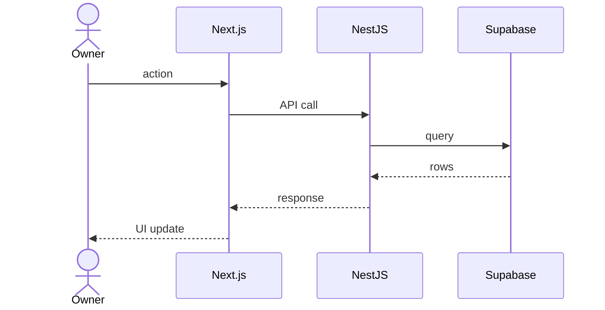

# Architecture: <Feature>

**Spec:** <link>
**Ticket:** CU-XXXX
**ADRs created:** ADR-NNNN, ADR-MMMM
**Date:** YYYY-MM-DD
**Author:** architect (agent)

## 1. Summary
3–5 sentences: what we're building technically.

## 2. Data model changes
- New tables, columns, indices.
- Migration plan (forward + rollback).
- RLS policies (mandatory).
- Seed data (if needed for dev).

## 3. API contract
- New / changed endpoints.
- Request/response shapes (or link to zod schemas in `packages/shared`).
- Auth requirements.
- Error cases.

## 4. Frontend impact
- New routes / pages.
- New components or shared UI.
- State management implications.
- i18n keys required.

## 5. Integrations
- External services touched (Supabase, Brevo, WhatsApp, Stripe, ...).
- Webhooks / async flows.

## 6. Sequence diagrams
For any non-trivial flow. Use Mermaid:

## 7. Performance & scale notes
What's the expected load? Anything that needs caching, indexing, or pagination?

## 8. Security notes
- Authorization model.
- Data validation points.
- Rate-limiting needs.
- PII handling.

## 9. Ticket breakdown
| Ticket | Title | Agent | Depends on |
|---|---|---|---|
| CU-XXXX | [BE] ... | developer-be | — |
| CU-YYYY | [FE] ... | developer-fe | CU-XXXX |
| CU-ZZZZ | [DEVOPS] ... | developer-devops | — |

## 10. Open questions
What still needs resolution before implementation can start?
